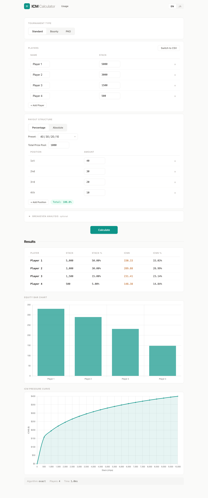
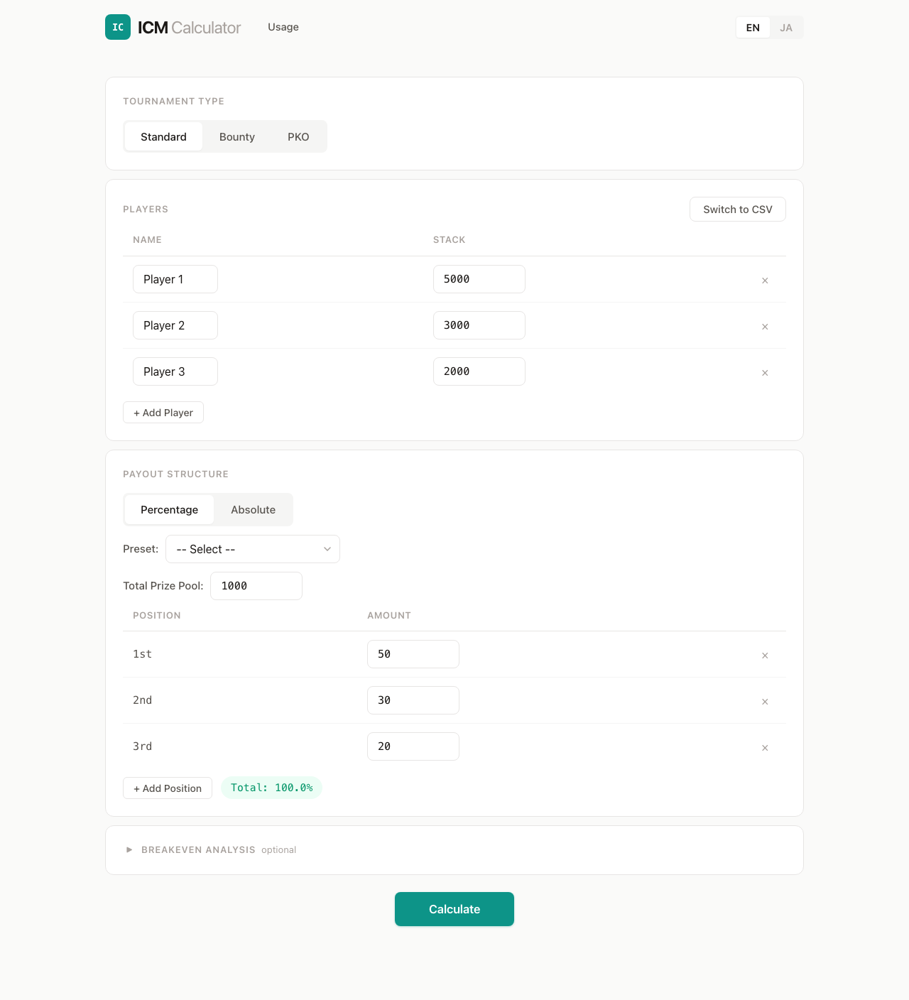
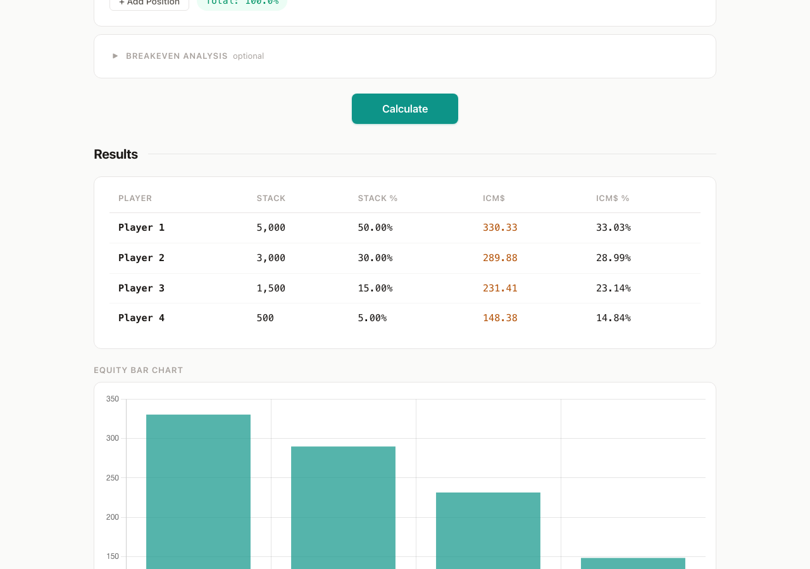
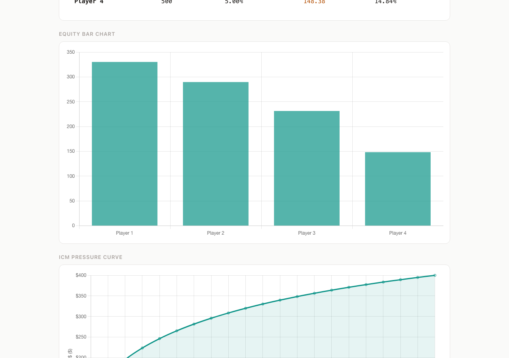

# WASM ICM Calculator

A browser-based ICM (Independent Chip Model) calculator for poker tournaments. All computation runs client-side via WebAssembly — no server required.



## What is this?

The [Independent Chip Model (ICM)](https://en.wikipedia.org/wiki/Independent_Chip_Model) converts chip stacks into dollar equity in poker tournaments. This tool calculates ICM equity for standard, bounty knockout, and progressive knockout (PKO) tournaments — entirely in your browser.

Unlike existing tools, this calculator is **free, open-source, and runs 100% client-side**. No data is sent to any server.

## Features

- **Standard ICM** — Exact Malmuth-Harville calculation (up to 20 players) with Monte Carlo approximation for larger fields (up to 50)
- **Bounty Knockout** — Expected bounty equity based on stack-proportional knockout probabilities
- **Progressive Knockout (PKO)** — Bounty inheritance modeling with configurable inheritance rate
- **Breakeven Analysis** — Compare ICM equity against entry fee to see if your position is profitable
- **ICM Pressure Curve** — Visualize the diminishing marginal value of chips
- **Internationalization** — English and Japanese
- **CSV Import** — Paste or import player data from CSV

## Try It

**[Open the calculator](https://whywaita.github.io/wasm-icm-calculator/)**

## Screenshots

### Input Form



### Results Table



### Charts



## Getting Started (Development)

### Prerequisites

- [Rust](https://rustup.rs/) with `wasm32-unknown-unknown` target
- [wasm-pack](https://rustwasm.github.io/wasm-pack/)
- [Node.js](https://nodejs.org/) (v20+)

### Build

```bash
# Add WASM target
rustup target add wasm32-unknown-unknown

# Build the WASM engine
wasm-pack build icm-engine --target web --out-dir ../web/pkg

# Install web dependencies
cd web && npm ci

# Start dev server
npm run dev
```

### Test

```bash
# Rust engine tests
cd icm-engine && cargo test

# Web frontend tests
cd web && npm test
```

## Tech Stack

| Component | Technology |
| :--- | :--- |
| ICM Engine | Rust, compiled to WASM via `wasm-pack` |
| Web Worker | Runs WASM off the main thread |
| UI | Preact + Vite |
| Charts | Chart.js |
| Hosting | GitHub Pages (auto-deployed on push to `main`) |

## Documentation

- [Usage Guide](docs/usage-en.md) — Detailed guide for breakeven analysis, charts, and pressure curves
- [Design Document](docs/design.md) — Architecture, algorithms, and data models

## Contributing

Contributions are welcome! Feel free to open issues or submit pull requests.

## License

Apache 2.0
