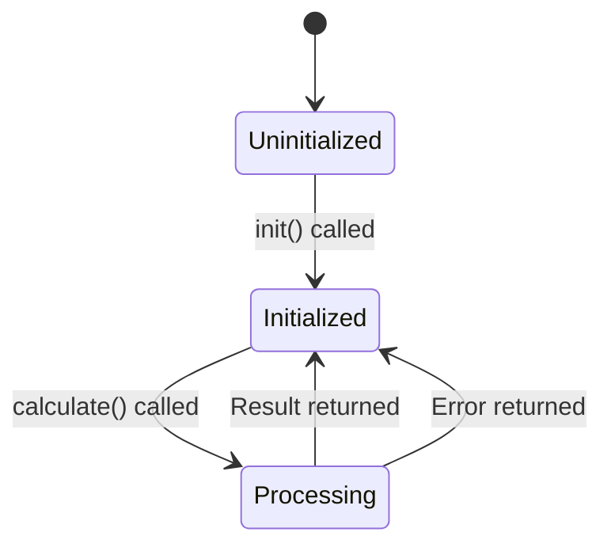

# Spec: WASM ICM Calculator

## Overview

A browser-based ICM (Independent Chip Model) calculator for poker MTT tournaments. The application consists of two main components: an ICM calculation engine written in Rust compiled to WebAssembly, and a Preact-based frontend. All computation runs client-side in a Web Worker. The application is deployed as a static site on GitHub Pages.

The calculator supports three tournament types (Standard, Bounty KO, PKO), breakeven analysis against entry fees, and visualizes results as tables, equity bar charts, and ICM pressure curves. The UI supports English (default) and Japanese.

## Scope

### In Scope

- Standard ICM equity calculation (Malmuth-Harville model)
- Bounty knockout equity calculation
- PKO (Progressive Knockout) bounty equity calculation with configurable inheritance rate
- Breakeven analysis (ICM$ vs entry fee with rake separation)
- Result visualization: table, equity bar chart, ICM pressure curve (Chart.js)
- Payout structure presets (common tournament payout distributions)
- i18n: English and Japanese (custom JSON loader, engine errors in English translated by UI)
- Up to 50 players
- Exact calculation (n <= 20) with bitmask memoization (pruned by payout positions depth)
- Monte Carlo approximation (20 < n <= 50, fixed 100,000 iterations, random seed)
- Input validation in the WASM engine
- GitHub Pages deployment via GitHub Actions
- Apache 2.0 license

### Out of Scope

- Hand history import or poker client integration
- Deal/chop negotiation
- Mobile-native application
- User accounts or server-side data persistence
- Non-MTT formats (cash game, Sit & Go)
- Player stack presets (v1) (Note: payout structure presets ARE in scope)
- Skill/position-based knockout probability models

## Terminology

| Term | Definition |
| :--- | :--- |
| ICM | Independent Chip Model. A mathematical model that converts chip stacks into prize pool equity. |
| ICM$ | The dollar-equivalent equity of a player's chip stack, calculated via ICM. Unitless in this tool. |
| MTT | Multi-Table Tournament. A poker tournament format with multiple tables. |
| Bounty KO | A tournament where a fixed bounty is awarded for knocking out each player. Bounties do not change. |
| PKO | Progressive Knockout. A tournament where a portion of the eliminated player's bounty is inherited by the eliminator. |
| Inheritance Rate | The fraction of a knocked-out player's bounty that is added to the eliminator's own bounty (PKO only). Default: 0.5. |
| Entry Fee | The total amount a player pays to enter a tournament, equal to buy-in + rake. |
| Buy-in | The portion of the entry fee that goes into the prize pool. |
| Rake | The portion of the entry fee retained by the operator. |
| Malmuth-Harville | The standard ICM calculation model. Computes finishing probabilities recursively from stack ratios. |
| Bitmask Memoization | An optimization technique representing eliminated player sets as `u32` bitmasks for cache lookup. |

## Functional Requirements

### FR-1: Tournament Type Selection

- **Description**: The user selects one of three tournament types: Standard, Bounty, or PKO.
- **Success**: The UI displays input fields appropriate for the selected type. Bounty/PKO types show the bounty value input. PKO type additionally shows the inheritance rate input.
- **Failure**: N/A (radio selection; one type is always selected).

### FR-2: Player Stack Input

- **Description**: The user enters chip stacks for 2 to 50 players. Input is accepted via two switchable modes: (1) an editable table with add/remove row controls, or (2) a CSV text area for bulk paste. The CSV format is unified: `name,stack,bounty` where bounty is optional (omitted for Standard tournaments). Each player has an optional name label.
- **Success**: The stacks are parsed into an array of positive numbers. The table displays one row per player. Switching between modes preserves the data.
- **Failure**: If any stack is <= 0, the WASM engine returns a validation error. The UI displays the error message next to the offending field.

### FR-3: Prize Structure Input

- **Description**: The user enters the payout structure as either percentages or absolute amounts, ordered by finishing position (1st, 2nd, ...). Common payout presets are available (e.g., 50/30/20, standard MTT structures). The UI displays the running total of payouts in real-time as the user types.
- **Success**: The payouts are parsed. For percentage type, the sum equals 100% (with ±0.01% tolerance; values are auto-normalized to exactly 100% for calculation) and `totalPrizePool` is provided. For absolute type, the sum is <= `totalPrizePool`. The number of payout positions is <= the number of players.
- **Failure**: Validation errors are returned by the WASM engine and displayed in the UI.

### FR-4: Bounty Value Input (Bounty/PKO only)

- **Description**: The user enters a bounty value for each player. The bounty value represents the amount awarded for knocking out that player. Values are unitless and displayed as ICM$.
- **Success**: Each bounty value is >= 0.
- **Failure**: Negative bounty values produce a validation error.

### FR-5: PKO Inheritance Rate Input (PKO only)

- **Description**: The user enters the inheritance rate for PKO tournaments.
- **Default**: 0.5 (50%).
- **Success**: The value is in the range (0, 1].
- **Failure**: Values outside (0, 1] produce a validation error.

### FR-6: ICM Calculation Execution

- **Description**: The user clicks the "Calculate" button. The input is serialized as JSON and sent to the Web Worker via `postMessage`. The WASM engine performs the calculation and returns the result. The "Calculate" button is disabled while a calculation is in progress.
- **Success**: The result JSON is returned to the UI thread. The results table, bar chart, and ICM pressure curve are rendered. The button is re-enabled.
- **Failure**: If validation fails, the WASM engine returns an error JSON. The UI displays the error messages. If the WASM engine throws an unexpected error, the UI displays a generic error message. The button is re-enabled in both cases.

### FR-7: Standard ICM Calculation

- **Description**: For `tournamentType: "standard"`, the engine computes ICM equity for each player using the Malmuth-Harville model.
- **Algorithm selection**:
  - n <= 20: Exact recursive enumeration with `u32` bitmask memoization. The memoization table maps `(player_index: usize, eliminated_bitmask: u32)` to `f64` probability. The recursion depth is pruned by the number of payout positions (not n), dramatically reducing cache size when payout positions << n.
  - 20 < n <= 50: Monte Carlo simulation with random elimination order sampling. Fixed 100,000 iterations per calculation. Random seed (non-deterministic; results vary slightly between runs).
- **Success**: Returns `PlayerResult[]` with `icmEquity` and `icmEquityPercentage` for each player. `Σ icmEquity = totalPrizePool` (invariant).
- **Failure**: Validation errors for invalid input.

### FR-8: Bounty KO Calculation

- **Description**: For `tournamentType: "bounty"`, the engine computes standard ICM equity plus bounty equity for each player.
- **Bounty equity formula**: `bounty_equity(i) = Σ_{j≠i} P(i knocks out j) * bounty(j)`
- **Knockout probability**: `P(i knocks out j) = stack_i / (stack_i + stack_j)` (pairwise model).
- **Total equity**: `Total_equity(i) = ICM_equity(i) + bounty_equity(i)`
- **Success**: Returns `PlayerResult[]` with `icmEquity`, `bountyEquity`, and `totalEquity`.
- **Failure**: Validation errors for invalid input. If `bounty` is missing for any player when `tournamentType` is `"bounty"`, the engine returns a validation error.

### FR-9: PKO Calculation

- **Description**: For `tournamentType: "pko"`, the engine computes ICM equity plus PKO bounty equity using a recursive model.
- **PKO bounty formula**:
  ```
  E[bounty_value(i)] = Σ_{j≠i} P(i knocks out j) * [
    (1 - r) * bounty(j)
    + r * E[inherited bounty from j's accumulated bounty]
  ]
  ```
  Where `r` = `pkoConfig.inheritanceRate` (default 0.5).
- **Knockout probability**: Same pairwise model as FR-8.
- **Recursion cutoff**: The recursion terminates dynamically based on the inheritance rate: when `r^depth < 0.1` (where `r` = inheritance rate), further recursion contributes less than 10% of the original bounty value and is cut off. For example, at r=0.5, cutoff is at depth 4 (0.5^4 = 0.0625); at r=0.8, cutoff is at depth 11 (0.8^11 ≈ 0.086).
- **Success**: Returns `PlayerResult[]` with `icmEquity`, `bountyEquity`, and `totalEquity`.
- **Failure**: Validation errors for invalid input. If `pkoConfig` is missing when `tournamentType` is `"pko"`, the engine uses the default inheritance rate of 0.5.

### FR-10: Breakeven Analysis

- **Description**: When the user provides breakeven input (entry fee, buy-in, rake, starting chips), the engine computes breakeven metrics for each player.
- **Entry Fee UI**: The user enters the total entry fee. The UI auto-calculates buy-in and rake (default rake: 10% of entry fee). The user can manually edit buy-in and rake. The constraint `entry_fee = buy_in + rake` is maintained by the UI.
- **Formulas**:
  - `icm_dollar = ICM_equity(i)` (standard) or `Total_equity(i)` (bounty/pko)
  - `profit_loss = icm_dollar - entry_fee`
  - `is_above_breakeven = profit_loss > 0`
  - `chip_ev_per_starting_chip = buy_in / starting_chips`
  - `current_chip_ev = stack(i) * chip_ev_per_starting_chip`
  - `icm_premium = icm_dollar / current_chip_ev`
- **Success**: Returns `BreakevenResult` for each player.
- **Failure**: Validation errors if entry fee <= 0, rake < 0, rake >= entry fee, or starting chips <= 0.

### FR-11: Results Table

- **Description**: The results are displayed as a sortable table.
- **Columns (Standard)**: Player Name, Stack, Stack %, ICM$, ICM$ %
- **Columns (Bounty/PKO)**: Player Name, Stack, Stack %, ICM$, Bounty Equity, Total Equity
- **Columns (with Breakeven)**: Above columns + Entry Fee, Profit/Loss, ICM Premium
- **Display precision**: ICM$ values are displayed with 2 decimal places. Percentage values are displayed with 2 decimal places.
- **Default sort**: Stack descending. Columns are sortable by clicking headers.
- **Failure**: N/A (data comes from calculation result).

### FR-12: Equity Bar Chart

- **Description**: A horizontal or vertical bar chart showing each player's equity.
- **Standard**: Bars represent ICM$.
- **Bounty/PKO**: Stacked bars showing ICM$ and Bounty Equity portions.
- **Success**: The chart renders with correct proportions and labels.
- **Failure**: N/A.

### FR-13: ICM Pressure Curve

- **Description**: A single line chart showing the relationship between a hypothetical chip stack and ICM$ value across the current player field. The curve is computed by the WASM engine as part of the `calculate()` response (not via separate API calls), reusing the memoization cache from the main calculation.
- **X-axis**: Chip stack (from 0 to max stack in the field).
- **Y-axis**: Corresponding ICM$ value.
- **Data points**: Dynamic based on algorithm — exact: 20 points, Monte Carlo: 50 points. Each player's actual position is marked on the curve as a dot.
- **Computation**: The engine varies a hypothetical player's stack while holding all other players' stacks constant, computing ICM$ at each point.
- **Success**: The curve is rendered, showing the diminishing marginal value of chips (ICM pressure).
- **Failure**: N/A.

### FR-14: i18n (English + Japanese)

- **Description**: The UI supports English (default) and Japanese. The user can switch languages via a language selector.
- **Implementation**: Custom JSON-based translation loader (no external i18n library). Translation files are bundled as static JSON.
- **Engine errors**: The WASM engine returns error messages in English only. The UI translates engine error messages using an error code/message mapping table in the translation JSON.
- **Scope**: All UI labels, error messages, tooltips, and help text are translated. Calculation results (numbers) are not affected.
- **Success**: Switching language re-renders the UI in the selected language. The selection persists via `localStorage`.
- **Failure**: If `localStorage` is unavailable, the default language (English) is used.

### FR-15: Engine Info

- **Description**: The `get_engine_info()` function returns a JSON string with the engine version and supported features.
- **Success**: Returns `{ version: string, algorithms: string[], maxPlayers: number }`.
- **Failure**: N/A.

## Non-Functional Requirements

### NFR-1: Performance

- **Requirement**: Calculation completes in < 1 second for up to 50 players on modern hardware (2020+ desktop/laptop browser).
- **Exact algorithm (n <= 20)**: Sub-second with bitmask memoization.
- **Monte Carlo (20 < n <= 50)**: Sub-second with appropriate iteration count.
- **Measurement**: `ResultMetadata.calculationTimeMs` reports the elapsed time.

### NFR-2: Zero Server Dependency

- **Requirement**: The application functions entirely offline after the initial page load. No HTTP requests are made during or after calculation.
- **Verification**: The application runs correctly with network disabled after initial load.

### NFR-3: Browser Compatibility

- **Requirement**: The application runs on the latest stable versions of Chrome, Firefox, Safari, and Edge.
- **Dependencies**: Web Worker API, WebAssembly, `postMessage`, `localStorage`.

### NFR-4: UI Responsiveness

- **Requirement**: The UI thread is never blocked by calculations. All WASM execution occurs in a Web Worker.
- **Verification**: UI remains interactive (button clicks, input fields) during calculation.

### NFR-5: Build Reproducibility

- **Requirement**: The build is deterministic. Given the same source code and toolchain versions, the output is identical.
- **Toolchain**: `wasm-pack --target web` (Rust → WASM ES module), `vite` (Preact → static bundle).

### NFR-6: Bundle Size

- **Requirement**: The WASM binary is < 1 MB (gzipped). No special optimization (wasm-opt) is required for v1; add if measured size exceeds the threshold.

### NFR-7: Accessibility

- **Requirement**: The UI is keyboard-navigable and uses semantic HTML. Form inputs have associated labels.

### NFR-8: Chart Library

- **Requirement**: Chart.js is used for equity bar charts and ICM pressure curve rendering.
- **Tree-shaking**: Only required Chart.js modules (bar, line) are imported to minimize bundle size.

### NFR-9: Cache Management

- **Requirement**: A Service Worker handles cache busting for WASM and static assets to ensure users receive updated versions on deployment.
- **Scope**: Cache busting only. Full offline page loading (PWA) is NOT in scope for v1.

### NFR-10: Test Precision

- **Requirement**: Property-based tests use the following f64 tolerances for the `Σ icmEquity = totalPrizePool` invariant:
  - Exact algorithm: epsilon = 1e-10 (floating-point error only)
  - Monte Carlo: epsilon = 1e-2 (includes statistical error from 100,000 iterations)

## API / Interface

### WASM Exported Functions

#### `calculate(input_json: &str) -> Result<String, JsValue>`

Unified calculation entry point.

**Input JSON** (`CalculationInput`):

```json
{
  "tournamentType": "standard" | "bounty" | "pko",
  "players": [
    { "name": "Player 1", "stack": 5000, "bounty": 10 }
  ],
  "prizeStructure": {
    "type": "percentage" | "absolute",
    "payouts": [50, 30, 20],
    "totalPrizePool": 1000
  },
  "pkoConfig": {
    "inheritanceRate": 0.5
  },
  "breakeven": {
    "entryFee": 110,
    "buyIn": 100,
    "rake": 10,
    "startingChips": 10000
  }
}
```

**Success Response JSON** (`CalculationResult`):

```json
{
  "players": [
    {
      "name": "Player 1",
      "stack": 5000,
      "stackPercentage": 33.33,
      "icmEquity": 350.00,
      "icmEquityPercentage": 35.00,
      "bountyEquity": 12.50,
      "totalEquity": 362.50,
      "breakeven": {
        "icmDollar": 362.50,
        "entryFee": 110,
        "buyIn": 100,
        "profitLoss": 252.50,
        "isAboveBreakeven": true
      }
    }
  ],
  "pressureCurve": [
    { "stack": 0, "icmEquity": 0.0 },
    { "stack": 2500, "icmEquity": 200.0 },
    { "stack": 5000, "icmEquity": 350.0 },
    { "stack": 10000, "icmEquity": 550.0 }
  ],
  "metadata": {
    "algorithm": "exact",
    "playerCount": 3,
    "calculationTimeMs": 1.5
  }
}
```

**Error Response JSON**:

```json
{
  "error": true,
  "validationErrors": [
    {
      "field": "players[0].stack",
      "message": "Stack must be positive"
    }
  ]
}
```

#### `get_engine_info() -> String`

Returns engine metadata.

**Response JSON**:

```json
{
  "version": "0.1.0",
  "algorithms": ["exact", "approximate"],
  "maxPlayers": 50
}
```

### Web Worker Message Protocol

#### UI → Worker

```typescript
interface WorkerRequest {
  type: "calculate";
  data: CalculationInput;
}
```

#### Worker → UI

```typescript
interface WorkerSuccessResponse {
  type: "result";
  data: CalculationResult;
}

interface WorkerErrorResponse {
  type: "error";
  message: string;
  validationErrors?: ValidationError[];
}
```

## Data Model

### Input Types

```typescript
interface CalculationInput {
  tournamentType: "standard" | "bounty" | "pko";
  players: PlayerInput[];
  prizeStructure: PrizeStructure;
  pkoConfig?: PkoConfig;
  breakeven?: BreakevenInput;
}

interface PlayerInput {
  name?: string;
  stack: number;
  bounty?: number;
}

interface PrizeStructure {
  type: "percentage" | "absolute";
  payouts: number[];
  totalPrizePool?: number;
}

interface PkoConfig {
  inheritanceRate: number;
}

interface BreakevenInput {
  entryFee: number;
  buyIn: number;
  rake: number;
  startingChips: number;
}
```

### Output Types

```typescript
interface CalculationResult {
  players: PlayerResult[];
  pressureCurve: PressureCurvePoint[];
  metadata: ResultMetadata;
}

interface PressureCurvePoint {
  stack: number;
  icmEquity: number;
}

interface PlayerResult {
  name?: string;
  stack: number;
  stackPercentage: number;
  icmEquity: number;
  icmEquityPercentage: number;
  bountyEquity?: number;
  totalEquity?: number;
  breakeven?: BreakevenResult;
}

interface BreakevenResult {
  icmDollar: number;
  entryFee: number;
  buyIn: number;
  profitLoss: number;
  isAboveBreakeven: boolean;
}

interface ResultMetadata {
  algorithm: "exact" | "approximate";
  playerCount: number;
  calculationTimeMs: number;
}
```

### Rust Internal Types

```rust
// Input (deserialized from JSON)
struct CalculationInput {
    tournament_type: TournamentType,
    stacks: Vec<f64>,
    payouts: Vec<f64>,
    total_prize_pool: f64,
    bounties: Option<Vec<f64>>,
    pko_inheritance_rate: Option<f64>,
    entry_fee: Option<f64>,
    buy_in: Option<f64>,
    rake: Option<f64>,
    starting_chips: Option<f64>,
}

enum TournamentType {
    Standard,
    Bounty,
    Pko,
}

// Memoization cache
type MemoCache = HashMap<(usize, u32), f64>;

// Output (serialized to JSON)
struct CalculationResult {
    players: Vec<PlayerResult>,
    pressure_curve: Vec<PressureCurvePoint>,
    metadata: ResultMetadata,
}

struct PressureCurvePoint {
    stack: f64,
    icm_equity: f64,
}
```

### Validation Rules

| Field | Condition | Error Message |
| :--- | :--- | :--- |
| `players` | `len >= 2` | "At least 2 players are required" |
| `players` | `len <= 50` | "Maximum 50 players supported" |
| `players[i].stack` | `> 0` | "Stack must be positive" |
| `players[i].bounty` | `>= 0` (when tournamentType is bounty/pko) | "Bounty must be non-negative" |
| `players[i].bounty` | Required when tournamentType is bounty/pko | "Bounty is required for bounty/pko tournaments" |
| `prizeStructure.payouts` | `len >= 1` | "At least 1 payout position is required" |
| `prizeStructure.payouts` | `len <= players.len` | "Payout positions cannot exceed player count" |
| `prizeStructure.payouts` | Sum within 100% ± 0.01% tolerance (percentage, auto-normalized) or sum <= totalPrizePool (absolute) | "Payout sum must equal 100% (percentage) or be within prize pool (absolute)" |
| `prizeStructure.totalPrizePool` | Required and > 0 when type is "percentage" | "Total prize pool is required for percentage payouts" |
| `pkoConfig.inheritanceRate` | `> 0 && <= 1` | "Inheritance rate must be between 0 (exclusive) and 1 (inclusive)" |
| `breakeven.entryFee` | `> 0` | "Entry fee must be positive" |
| `breakeven.rake` | `>= 0 && < entryFee` | "Rake must be non-negative and less than entry fee" |
| `breakeven.buyIn` | `== entryFee - rake` | "Buy-in must equal entry fee minus rake" |
| `breakeven.startingChips` | `> 0` | "Starting chips must be positive" |

## State Transitions

### Application State

```mermaid
stateDiagram-v2
    [*] --> Idle: Page loaded
    Idle --> WasmLoading: First calculation triggered
    WasmLoading --> Ready: WASM initialized in Worker
    WasmLoading --> Error: WASM failed to load
    Ready --> Calculating: Calculate button clicked
    Calculating --> ResultsDisplayed: Calculation succeeded
    Calculating --> ValidationError: Input validation failed
    ValidationError --> Ready: User corrects input
    ResultsDisplayed --> Calculating: Input changed + recalculate
    ResultsDisplayed --> Ready: Input changed (results cleared)
    Error --> [*]
```



### WASM Engine State (within Worker)



## Security

- **No server communication**: The application makes zero network requests after the initial page load. No data leaves the browser.
- **No data persistence**: No cookies, no server-side storage. Language preference is stored in `localStorage` only.
- **Input sanitization**: All input is validated in the Rust/WASM engine before computation. Invalid inputs are rejected with descriptive error messages.
- **No user-generated content rendering**: The application does not render user-provided HTML or markdown. Player names are text-only and escaped in the DOM.
- **CSP**: The GitHub Pages deployment uses a Content Security Policy that allows `wasm-unsafe-eval` (required for WASM) and blocks inline scripts.

## Decision Records

### DR-1: Unified WASM API

- **Status**: Accepted
- **Context**: The original design had 4 separate WASM functions (`calculate_icm`, `calculate_icm_bounty`, `calculate_icm_pko`, `calculate_breakeven`). This required the JS side to manage call routing.
- **Decision**: Consolidate into a single `calculate(input_json)` function. The `tournamentType` field determines the calculation mode internally.
- **Consequences**: Simpler JS integration. Breakeven analysis is computed alongside ICM in a single call, avoiding redundant computation.

### DR-2: Web Worker for WASM Execution

- **Status**: Accepted
- **Context**: ICM calculation with memoization for n=20 or Monte Carlo for n=50 can take hundreds of milliseconds, blocking the UI thread.
- **Decision**: Run the WASM engine in a Web Worker. Communication uses `postMessage` with JSON serialization.
- **Consequences**: UI remains responsive during calculation. Adds complexity for Worker lifecycle management and message passing.

### DR-3: Knockout Acquisition Model for Bounty

- **Status**: Accepted
- **Context**: The original design described bounty calculation as "chip-proportional pool distribution", which did not match actual tournament mechanics.
- **Decision**: Use a knockout acquisition model where `bounty_equity(i) = Σ P(i knocks out j) * bounty(j)` with pairwise stack-proportional knockout probabilities.
- **Consequences**: Accurately models the expected bounty income. Knockout probability is simplified to `stack_i / (stack_i + stack_j)`.

### DR-4: Entry Fee Auto-Split UI

- **Status**: Accepted
- **Context**: The original design had a single `buyIn` field (including rake) with a `prizeReturnRate` multiplier, which was confusing.
- **Decision**: The user enters the total entry fee. The UI auto-splits into buy-in and rake (default 10% rake, editable). The constraint `entry_fee = buy_in + rake` is maintained.
- **Consequences**: More intuitive input. The user sees exactly how their entry fee is divided.

### DR-5: Bitmask Memoization for Exact ICM

- **Status**: Accepted
- **Context**: Naive Malmuth-Harville has O(n!/(n-p)!) complexity, infeasible for n=20.
- **Decision**: Represent eliminated player sets as `u32` bitmasks. Use `HashMap<(usize, u32), f64>` as the memoization cache. Recursion depth is pruned by the number of payout positions (not n), since ICM equity only depends on finishing probabilities for paid positions.
- **Consequences**: Dramatically reduces computation for n <= 20. With payout position pruning, cache size is bounded by `n * C(n, p)` where p = payout positions, which is far smaller than `n * 2^n` when p << n.

### DR-6: Monte Carlo for Large Fields

- **Status**: Accepted
- **Context**: Exact calculation is infeasible for n > 20 even with memoization.
- **Decision**: Use Monte Carlo simulation with random elimination order sampling for 20 < n <= 50. Fixed 100,000 iterations. Random (non-deterministic) seed per calculation.
- **Consequences**: ~99.5% accuracy for typical fields. Computation time scales linearly with iteration count. Same input may produce slightly different results on each run, which naturally communicates the approximate nature of the calculation.

### DR-7: PKO Dynamic Recursion Cutoff

- **Status**: Accepted (updated from fixed 3-player cutoff)
- **Context**: PKO bounty equity requires recursive computation of inherited bounty values. A fixed cutoff at 3 remaining players is insufficient for high inheritance rates (e.g., r=0.8 leaves 51.2% of bounty unaccounted at depth 3).
- **Decision**: Cut off the recursion dynamically when `r^depth < 0.1`, where `r` is the inheritance rate. This ensures that the unaccounted bounty fraction is always below 10%.
- **Consequences**: At r=0.5, cutoff at depth 4 (6.25% residual). At r=0.8, cutoff at depth 11 (8.6% residual). At r=0.9, cutoff at depth 22 (9.8% residual). Computation time increases with higher inheritance rates but remains bounded.

### DR-8: Stack-Proportional Knockout Probability

- **Status**: Accepted
- **Context**: Knockout probabilities could model skill, position, or other factors.
- **Decision**: v1 uses purely stack-proportional knockout probabilities: `P(i knocks out j) = stack_i / (stack_i + stack_j)`.
- **Consequences**: Objective and deterministic. No subjective inputs required from the user.

### DR-9: Apache 2.0 License

- **Status**: Accepted
- **Context**: The project needs a permissive open-source license.
- **Decision**: Apache 2.0.
- **Consequences**: Permissive with patent protection. Compatible with most other open-source licenses.

### DR-10: Full Visualization from v1

- **Status**: Accepted
- **Context**: Results could be displayed as tables only (simpler) or with charts (more informative).
- **Decision**: Include table, equity bar chart, and ICM pressure curve from v1.
- **Consequences**: Higher initial implementation cost. Requires a chart rendering library. Provides richer analysis for advanced users.

### DR-11: i18n from v1 (English + Japanese)

- **Status**: Accepted
- **Context**: i18n could be deferred to v2, but retrofitting is more expensive.
- **Decision**: Support English (default) and Japanese from v1.
- **Consequences**: Requires i18n infrastructure from the start. All UI strings must be externalized.

### DR-12: Input Validation in Rust/WASM

- **Status**: Accepted
- **Context**: Validation could occur in the UI (TypeScript), the engine (Rust), or both.
- **Decision**: All validation is performed in the Rust/WASM engine. Errors are returned as structured JSON.
- **Consequences**: Single source of truth for validation logic. The UI displays errors from the engine. No risk of validation drift between layers.

## Open Questions

### Resolved

- [x] **Monte Carlo iteration count**: Fixed 100,000 iterations. Not user-configurable. → See DR-6, FR-7.
- [x] **Chart library selection**: Chart.js. → See NFR-8.
- [x] **i18n implementation**: Custom JSON-based translation loader. Engine errors in English, translated by UI. → See FR-14.
- [x] **f64 precision tolerance**: exact: 1e-10, Monte Carlo: 1e-2. → See NFR-10.
- [x] **ICM pressure curve computation**: Single curve computed by engine in `calculate()` response. Dynamic points: exact 20, MC 50. → See FR-13.

### Remaining

- [ ] **Monte Carlo 100,000 回の精度検証**: 100,000 回で NFR-1 の < 1秒要件を満たしつつ十分な精度が得られるか、実装時にベンチマーク検証が必要。
- [ ] **PKO 動的カットオフの計算時間**: r=0.9 で depth=22 まで再帰する。計算時間とのバランスを実装時に検証。
- [ ] **Service Worker 更新フロー**: SW のバージョン管理と古いキャッシュの破棄タイミングの詳細設計。
- [ ] **Pressure curve のスタック範囲**: X軸の範囲（0 〜 max stack）で 0 近辺は ICM$ がほぼ 0。有効範囲の決定が必要。
- [ ] **Chart.js の tree-shaking 設定**: 必要なモジュールのみインポートする設定の検証。
- [ ] **CSV パースのエラーハンドリング**: 不正な CSV（列数不一致、非数値等）のエラーメッセージと表示方法の詳細。

## References

- [Design Doc](./design.md)
- [Decisions](./design-decisions.md)
- [Malmuth-Harville ICM Model](https://en.wikipedia.org/wiki/Independent_Chip_Model)
- [HoldemResources ICM Calculator](https://www.holdemresources.net/icmcalculator)
- [wasm-bindgen Guide](https://rustwasm.github.io/docs/wasm-bindgen/)
- [wasm-pack](https://rustwasm.github.io/wasm-pack/)
- [Preact](https://preactjs.com/)
- [Vite](https://vitejs.dev/)
