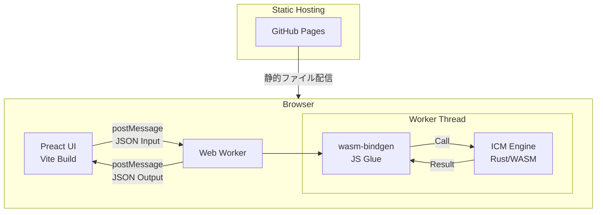
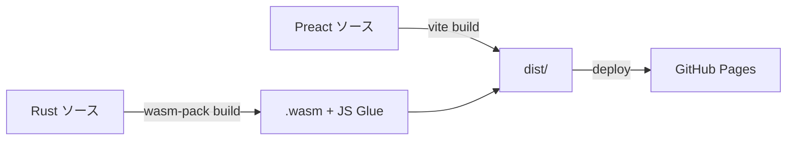
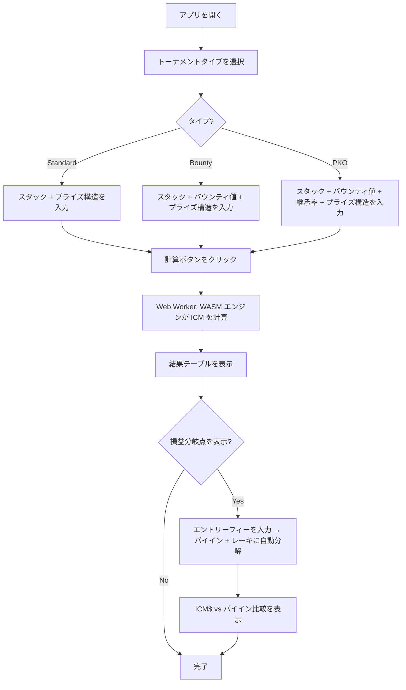

# 設計ドキュメント: WASM ICM Calculator

## 目次

- [概要](#概要)
- [動機](#動機)
- [Goals / Non-Goals](#goals--non-goals)
- [アーキテクチャ](#アーキテクチャ)
- [ユーザーフロー](#ユーザーフロー)
- [データモデル](#データモデル)
- [WASM API 設計](#wasm-api-設計)
- [ICM 計算アルゴリズム](#icm-計算アルゴリズム)
- [バウンティ / PKO 計算](#バウンティ--pko-計算)
- [損益分岐点分析](#損益分岐点分析)
- [バリデーション](#バリデーション)
- [テスト戦略](#テスト戦略)
- [Open Questions](#open-questions)
- [参考文献](#参考文献)

---

## 概要

ポーカー MTT（マルチテーブルトーナメント）向けのブラウザベース ICM（Independent Chip Model）計算機。すべての計算は Rust から WASM にコンパイルされたエンジンによりクライアントサイドで実行され、サーバは一切介さない。WASM エンジンは **Web Worker** 内で実行し、UI スレッドのブロッキングを防止する。標準的な ICM エクイティ計算に加え、バウンティノックアウト評価、PKO（Progressive Knockout）バウンティモデリング、ICM$ とエントリーフィーの損益分岐点分析をサポートする。

## 動機

### 課題

既存の ICM 計算機（例: [HoldemResources ICM Calculator](https://www.holdemresources.net/icmcalculator)）は標準的な ICM をカバーしているが、以下が不足している:

- **バウンティ対応**: ノックアウトバウンティトーナメントが増加しているが、多くのツールはバウンティ要素をエクイティ計算に含めていない。
- **PKO モデリング**: PKO トーナメントではバウンティの継承を追跡する必要があるが、標準的な ICM ツールは対応していない。
- **損益分岐点分析**: 現在の ICM$ がエントリーフィーを上回っているか（レーキと開始チップ量を考慮して）を知りたいプレイヤーが多い。

### なぜ今か

- PKO およびバウンティフォーマットは主要オンラインプラットフォーム（PokerStars, GGPoker, WPT Global）で支配的なトーナメント形式になっている。
- 現代のブラウザにおける WASM のパフォーマンスは、50人以上のプレイヤーでもリアルタイム ICM 計算に十分。
- 3つの機能すべてを組み合わせたオープンソースの ICM 計算機は存在しない。

### 既存ツールとの比較

| 機能 | HoldemResources | ICMIZER | 本ツール |
| :--- | :---: | :---: | :---: |
| 標準 ICM | Yes | Yes | Yes |
| バウンティ KO | No | 一部 | Yes |
| PKO バウンティ | No | Yes（有料） | Yes（無料/OSS） |
| 損益分岐点分析 | No | No | Yes |
| クライアントサイドのみ | No | No | Yes |
| オープンソース | No | No | Yes |

## Goals / Non-Goals

### Goals

1. **正確な ICM 計算**: Malmuth-Harville モデルをメモ化付きで使用し、大規模フィールド（20人以上）には近似アルゴリズムのオプションを提供。
2. **バウンティノックアウト統合**: 他プレイヤーをノックアウトして得られるバウンティの期待値をモデル化。
3. **PKO バウンティモデリング**: 設定可能な継承率（デフォルト 50%）でプレイヤーごとの期待バウンティ価値を計算。
4. **損益分岐点表示**: ICM$ とエントリーフィーを比較し、トーナメントポジションの評価を支援。
5. **サーバ依存ゼロ**: すべての計算はブラウザ内の Web Worker 上の WASM で実行。完全な静的サイトとして GitHub Pages にデプロイ可能。
6. **サブ秒の計算時間**: 最新のハードウェアで50人までのプレイヤーに対応。
7. **オープンソース**: Apache 2.0 ライセンスで公開。

### Non-Goals

- ハンド履歴のリアルタイムインポートやポーカークライアントとの連携。
- ディール交渉（例: チップチョップ計算機）— これは別ツール。
- モバイルネイティブアプリ（レスポンシブ Web で十分）。
- ユーザーアカウント、サーバ上のデータ永続化、アナリティクス。
- 非 MTT フォーマット（キャッシュゲーム、Sit & Go 固有機能）のサポート。

## アーキテクチャ



### コンポーネント責務

| コンポーネント | 技術 | 責務 |
| :--- | :--- | :--- |
| **ICM Engine** | Rust, `wasm-pack` で WASM にコンパイル | ICM 計算、バウンティ計算、PKO モデリング、損益分岐点分析、入力バリデーション |
| **Web Worker** | 標準 Web Worker API | WASM エンジンをメインスレッド外で実行し UI フリーズを防止 |
| **JS Glue** | `wasm-bindgen` + 生成された TS 型 | JS と WASM 間の型安全なブリッジ |
| **UI** | Preact + Vite | 入力フォーム、結果表示、チャート |
| **ホスティング** | GitHub Pages | 静的ファイル配信、GitHub Actions による CI/CD |

### ビルドパイプライン



## ユーザーフロー



### 入力フィールド

1. **トーナメントタイプ**: Standard / Bounty / PKO（ラジオ選択）
2. **プレイヤースタック**: 編集可能テーブルまたは CSV テキストエリア（切替可能）。CSV フォーマット: `name,stack,bounty`（bounty は省略可）
3. **プライズ構造**: 順位ごとのペイアウト（割合または絶対額）
4. **バウンティ値**（Bounty/PKO のみ）: 各プレイヤーをノックアウトした際に得られる金額（単位なし、ICM$ として表示）
5. **継承率**（PKO のみ）: ノックアウト時のバウンティ継承率（デフォルト: 50%）
6. **エントリーフィー**（損益分岐点分析）: トーナメント参加総額 → バイインとレーキに自動分解（デフォルトレーキ: 10%、編集可能）
7. **開始チップ数**（損益分岐点分析）: トーナメント開始時の初期スタック

## データモデル

### 入力スキーマ

```typescript
interface CalculationInput {
  tournamentType: "standard" | "bounty" | "pko";
  players: PlayerInput[];
  prizeStructure: PrizeStructure;
  // PKO 固有設定（tournamentType が "pko" の場合に必須）
  pkoConfig?: PkoConfig;
  // 損益分岐点分析（オプション）
  breakeven?: BreakevenInput;
}

interface PlayerInput {
  name?: string;           // オプションのラベル
  stack: number;           // チップ数
  bounty?: number;         // ノックアウトバウンティ値（bounty/pko のみ）
}

interface PrizeStructure {
  // 割合または絶対額
  type: "percentage" | "absolute";
  payouts: number[];       // 順位順（1位, 2位, ...）
  totalPrizePool?: number; // type が "percentage" の場合に必須
}

interface PkoConfig {
  inheritanceRate: number;  // 例: 0.5 = 50%（デフォルト）
}

interface BreakevenInput {
  entryFee: number;         // 参加総額（バイイン + レーキ）
  buyIn: number;            // エントリーフィーのうちプライズプール分
  rake: number;             // エントリーフィーのうちレーキ分
  startingChips: number;    // 開始時のチップ数
}
```

### 出力スキーマ

```typescript
interface CalculationResult {
  players: PlayerResult[];
  pressureCurve: { stack: number; icmEquity: number }[];
  metadata: ResultMetadata;
}

interface PlayerResult {
  name?: string;
  stack: number;
  stackPercentage: number;      // 全チップに対する %
  icmEquity: number;            // ICM$ 値
  icmEquityPercentage: number;  // プライズプールに対する %
  // バウンティ/PKO フィールド
  bountyEquity?: number;        // 期待バウンティ価値
  totalEquity?: number;         // ICM$ + バウンティエクイティ
  // 損益分岐点フィールド
  breakeven?: BreakevenResult;
}

interface BreakevenResult {
  icmDollar: number;            // 現在の ICM$（bounty/pko の場合は totalEquity）
  entryFee: number;             // エントリーフィー総額
  buyIn: number;                // バイイン（レーキ除く）
  profitLoss: number;           // ICM$ - entryFee
  isAboveBreakeven: boolean;    // 利益が出ていれば true
}

interface ResultMetadata {
  algorithm: "exact" | "approximate";
  playerCount: number;
  calculationTimeMs: number;
}
```

### Rust 内部構造体

```rust
#[wasm_bindgen]
pub struct IcmInput {
    tournament_type: String,     // "standard", "bounty", "pko"
    stacks: Vec<f64>,
    payouts: Vec<f64>,
    bounties: Option<Vec<f64>>,
    pko_inheritance_rate: Option<f64>,
    // 損益分岐点フィールド
    entry_fee: Option<f64>,
    buy_in: Option<f64>,
    rake: Option<f64>,
    starting_chips: Option<f64>,
}

#[wasm_bindgen]
pub struct IcmResult {
    equities: Vec<f64>,
    bounty_equities: Option<Vec<f64>>,
    breakeven_results: Option<Vec<BreakevenResultInternal>>,
    calculation_time_ms: f64,
    algorithm_used: String, // "exact" or "approximate"
}
```

## WASM API 設計

### エクスポート関数

WASM エンジンは単一の統合関数を公開する。入力 JSON の `tournamentType` フィールドで計算モードが決定される（standard、bounty、PKO）。損益分岐点分析はオプションの `breakeven` フィールドが存在する場合に含まれる。

```rust
/// 統合 ICM 計算エントリポイント。
/// JSON 入力を受け取り、JSON 出力を返す。
/// 計算モードは `tournamentType` フィールドで決定される。
/// 入力バリデーションはこの関数内で実行され、エラーは JSON で返される。
#[wasm_bindgen]
pub fn calculate(input_json: &str) -> Result<String, JsValue>;

/// サポートするアルゴリズム情報とバージョンを取得する。
#[wasm_bindgen]
pub fn get_engine_info() -> String;
```

### JS/TS ラッパー（生成 + 手動）

```typescript
// wasm-bindgen により自動生成、使いやすさのためラップ
import init, { calculate, get_engine_info } from "../pkg/icm_engine";

// Web Worker 初期化
let engineReady = false;

export async function initEngine(): Promise<void> {
  await init();
  engineReady = true;
}

export function compute(input: CalculationInput): CalculationResult {
  if (!engineReady) throw new Error("Engine not initialized");
  const json = JSON.stringify(input);
  const resultJson = calculate(json);
  return JSON.parse(resultJson);
}
```

### Web Worker 統合

```typescript
// worker.ts — 別スレッドで実行
import { initEngine, compute } from "./engine";

self.onmessage = async (e: MessageEvent<CalculationInput>) => {
  if (!engineReady) await initEngine();
  try {
    const result = compute(e.data);
    self.postMessage({ type: "result", data: result });
  } catch (err) {
    self.postMessage({ type: "error", message: String(err) });
  }
};
```

## ICM 計算アルゴリズム

### Malmuth-Harville モデル

プレイヤー *i* がポジション *k* でフィニッシュする確率は再帰的に計算される:

- **P(i が1位)** = `stack_i / total_chips`
- **P(i が k 位)** = すべての j != i について: `P(j が1位) * P(i が k 位 | j が脱落済み)` の合計

プレイヤー *i* のエクイティ:

```
ICM_equity(i) = Σ_k P(i が k 位でフィニッシュ) * prize(k)
```

### メモ化

厳密アルゴリズムはメモ化を使用して中間結果をキャッシュする。脱落済みプレイヤーの集合を **ビットマスク** で表現し、メモ化テーブルは `(player_index, eliminated_bitmask)` から計算済み確率へのマッピングを保持する。これにより、ナイーブな O(n!/(n-p)!) から実効的な計算量を大幅に削減する。

### 厳密計算 vs 近似計算

| | 厳密（メモ化付き） | 近似 |
| :--- | :--- | :--- |
| 計算量 | メモ化で削減（ビットマスクベースキャッシュ） | O(n * p * iterations) |
| 精度 | 厳密 | 典型的なフィールドで ~99.5% |
| 閾値 | n <= 20（デフォルト） | 20 < n <= 50 |
| 手法 | ビットマスクメモ化付き再帰的列挙 | ランダム脱落順序サンプリングによるモンテカルロシミュレーション |

サポートする最大プレイヤー数は **50人**。エンジンはプレイヤー数に基づいてアルゴリズムを自動選択するが、入力による手動オーバーライドも可能。モンテカルロは固定 **100,000 回**のイテレーションで、ランダム（非決定論的）シードを使用。

## バウンティ / PKO 計算

### 標準バウンティ（ノックアウト）

標準ノックアウトバウンティトーナメントでは、各プレイヤーは **バウンティ値** を持つ — そのプレイヤーをノックアウトしたプレイヤーに与えられる金額。バウンティ値はトーナメント中に変化しない。

プレイヤー *i* の期待バウンティエクイティは2つの要素で構成される:

1. **他者から得られるバウンティ**: 他プレイヤーをノックアウトする期待値（スタック比率から導出されるノックアウト確率で重み付け）
2. **自身のバウンティ負債**: プレイヤー *i* 自身のバウンティは、ノックアウトした相手に支払われる

```
bounty_equity(i) = Σ_{j≠i} P(i が j をノックアウト) * bounty(j)
```

各プレイヤーの総エクイティ:

```
Total_equity(i) = ICM_equity(i) + bounty_equity(i)
```

ノックアウト確率 `P(i が j をノックアウト)` は `stack_i / (stack_i + stack_j)` に比例する（簡略化ペアワイズモデル）。

### PKO（Progressive Knockout）モデル

PKO トーナメントにおいて、プレイヤー *j* がプレイヤー *k* をノックアウトした場合:
- プレイヤー *j* は `(1 - inheritance_rate) * bounty(k)` を即座に獲得
- プレイヤー *j* 自身のバウンティに `inheritance_rate * bounty(k)` が加算される

期待バウンティエクイティは **深さ制限付き再帰モデル** を使用:

```
E[bounty_value(i)] = Σ_{j≠i} P(i が j をノックアウト) * [
                       (1 - r) * bounty(j)
                       + r * E[j の累積バウンティから継承される価値]
                     ]
```

ここで `r` = 継承率（デフォルト 0.5）、ノックアウト確率はスタック比率から導出。

**再帰終了条件**: `r^depth < 0.1`（r = 継承率）で動的に再帰を打ち切る。未計算のバウンティ残存率が常に 10% 以下になることを保証する。

## 損益分岐点分析

### エントリーフィー構造

UI は簡潔なエントリーフィー入力を提供する:
1. ユーザーが **エントリーフィー** を入力（支払い総額、例: $110）
2. UI が自動で **バイイン** と **レーキ** を計算（デフォルトレーキ: 10%、編集可能）
3. ユーザーは必要に応じてバイインとレーキを手動調整可能

### ICM$ vs エントリーフィー

```
buy_in = entry_fee - rake
icm_dollar = ICM_equity(i)              // 標準トーナメントの場合
           | Total_equity(i)            // bounty/pko トーナメントの場合
profit_loss = icm_dollar - entry_fee
```

### チップ EV 乗数

```
chip_ev_per_starting_chip = buy_in / starting_chips
current_chip_ev = stack(i) * chip_ev_per_starting_chip
icm_premium = icm_dollar / current_chip_ev  // > 1 なら ICM がチップをより高く評価
```

## バリデーション

すべての入力バリデーションは WASM エンジン（Rust 側）で実行される。バリデーションエラーは構造化 JSON で返される。

### バリデーションルール

| フィールド | ルール |
| :--- | :--- |
| `players` | 2人以上のプレイヤーが必須 |
| `stack` | 正の値（> 0） |
| `bounty` | 非負の値（>= 0） |
| `payouts` | 合計が 100%（percentage タイプ）または totalPrizePool 以下（absolute タイプ） |
| `payouts` の長さ | プレイヤー数以下 |
| `inheritanceRate` | 範囲 (0, 1] |
| `entryFee` | 正の値 |
| `rake` | >= 0 かつ < entryFee |
| `startingChips` | 正の値 |

## テスト戦略

主なテストアプローチは **プロパティベースドテスト** である。数学的不変条件の検証に適しており、参照実装が存在しないバウンティ/PKO 計算の検証に特に有効。

### テストすべき主要な不変条件

1. **エクイティの合計 = プライズプール**: `Σ ICM_equity(i) = totalPrizePool`（全トーナメントタイプ）
2. **チップリーダーが最大 ICM エクイティ**: 最多チップのプレイヤーが最高の ICM$ を持つ
3. **単調性**: チップが多いプレイヤーは常にチップが少ないプレイヤー以上の ICM$ を持つ
4. **等スタック = 等エクイティ**: 同一スタックのプレイヤーは同一の ICM$ を持つ
5. **単一プレイヤー**: 残り1人のプレイヤーがプライズプール全額を獲得
6. **バウンティ合計の保存**: 全プレイヤーのバウンティエクイティ合計がバウンティプール全体と整合
7. **PKO 継承の保存**: ノックアウトイベント全体でシステム内のバウンティ総額が保存される

### 追加テスト

- HoldemResources の結果との照合（標準 ICM のみ）
- 小規模ケースの手計算（2-4人プレイヤー）によるバウンティ/PKO 検証

## 決定済み事項

以下の項目は以前 Open Questions であったが、解決済み:

| # | 質問 | 決定 | 根拠 |
| :--- | :--- | :--- | :--- |
| 1 | 近似アルゴリズム | **モンテカルロ**（ランダム脱落順序サンプリング） | 実装がシンプル、ICM の順位確率を自然にモデル化、反復回数で精度調整可能 |
| 2 | 最大プレイヤー数 | **50人** | ファイナルテーブル〜中盤の MTT をカバー、UI がシンプルに保てる |
| 3 | PKO ノックアウト確率モデル | **スタック比例のみ**（v1） | スキル/ポジション要素は主観的であり、客観的計算ツールの目的と矛盾する |
| 4 | 入力プリセット | **v1 ではプレイヤースタックプリセットなし**、ペイアウト構造プリセットは提供 | プレイヤープリセットは延期、ペイアウトプリセットは UX 向上に貢献 |
| 5 | 可視化 | **テーブル + エクイティ棒グラフ + ICM プレッシャーカーブ** | v1 からフル可視化で上級者向け分析を提供 |
| 6 | i18n | **英語（デフォルト）+ 日本語を v1 から** | 初期段階から2言語対応 |
| 7 | メモ化キャッシュ戦略 | **`u32` ビットマスク** + `HashMap<(usize, u32), f64>`、payout positions で枝刈り | 再帰の深さを payout positions 数に制限、キャッシュサイズを劇的に削減 |
| 8 | PKO 再帰打ち切り | **動的**: `r^depth < 0.1`（r = 継承率） | r=0.5 で深さ4（残存 6.25%）、r=0.8 で深さ11（残存 8.6%）。固定3人では高継承率時に精度不足 |

## 参考文献

- [Malmuth-Harville ICM Model](https://en.wikipedia.org/wiki/Independent_Chip_Model)
- [HoldemResources ICM Calculator](https://www.holdemresources.net/icmcalculator)
- [wasm-bindgen ガイド](https://rustwasm.github.io/docs/wasm-bindgen/)
- [wasm-pack](https://rustwasm.github.io/wasm-pack/)
- [Preact](https://preactjs.com/)
- [Vite](https://vitejs.dev/)
