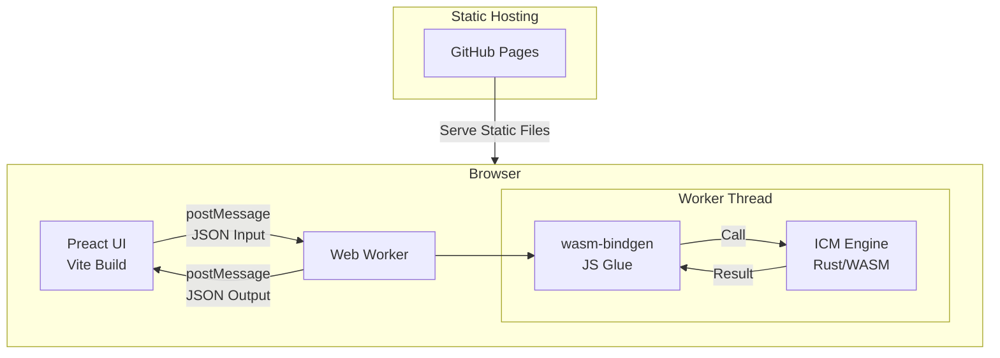
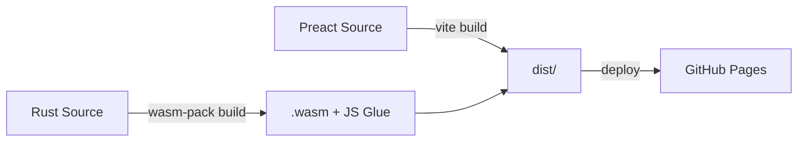
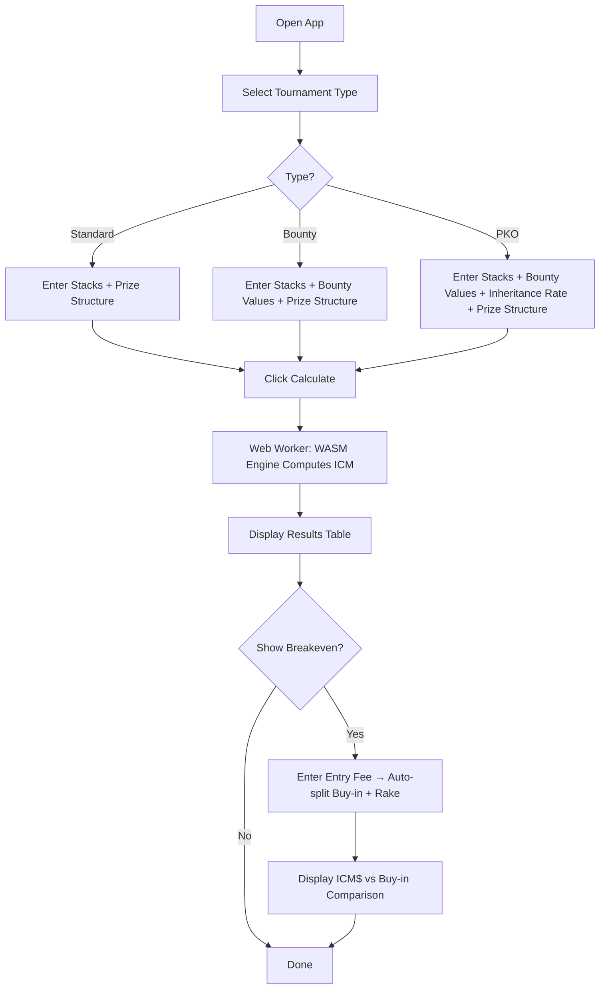

# Design Document: WASM ICM Calculator

## Table of Contents

- [Overview](#overview)
- [Motivation](#motivation)
- [Goals / Non-Goals](#goals--non-goals)
- [Architecture](#architecture)
- [User Flow](#user-flow)
- [Data Model](#data-model)
- [WASM API Design](#wasm-api-design)
- [ICM Calculation Algorithm](#icm-calculation-algorithm)
- [Bounty / PKO Calculation](#bounty--pko-calculation)
- [Breakeven Analysis](#breakeven-analysis)
- [Validation](#validation)
- [Testing Strategy](#testing-strategy)
- [Open Questions](#open-questions)
- [References](#references)

---

## Overview

A browser-based ICM (Independent Chip Model) calculator for poker MTT (Multi-Table Tournament) formats. All computation runs client-side via WebAssembly (WASM) compiled from Rust — no server is involved. The WASM engine runs in a **Web Worker** to avoid blocking the UI thread. The tool provides standard ICM equity calculation plus advanced features: Bounty knockout valuation, Progressive Knockout (PKO) bounty modeling, and breakeven analysis comparing ICM$ against tournament entry fee.

## Motivation

### Problem

Existing ICM calculators (e.g., [HoldemResources ICM Calculator](https://www.holdemresources.net/icmcalculator)) cover standard ICM well but lack:

- **Bounty support**: Knockout bounty tournaments are increasingly common, but most tools ignore the bounty component in equity calculation.
- **PKO (Progressive Knockout) modeling**: PKO tournaments require tracking bounty inheritance, which standard ICM tools do not handle.
- **Breakeven analysis**: Players want to know whether their current ICM$ exceeds their entry fee, factoring in rake and starting chip counts.

### Why Now

- PKO and bounty formats are now the dominant tournament type on major online platforms (PokerStars, GGPoker, WPT Global).
- WASM performance in modern browsers is sufficient for real-time ICM calculation with 50+ players.
- No open-source ICM calculator exists that combines all three features.

### Comparison with Existing Tools

| Feature | HoldemResources | ICMIZER | This Tool |
| :--- | :---: | :---: | :---: |
| Standard ICM | Yes | Yes | Yes |
| Bounty KO | No | Partial | Yes |
| PKO Bounty | No | Yes (paid) | Yes (free/OSS) |
| Breakeven Analysis | No | No | Yes |
| Client-side only | No | No | Yes |
| Open Source | No | No | Yes |

## Goals / Non-Goals

### Goals

1. **Accurate ICM calculation** using the Malmuth-Harville model with memoization, plus an approximation option for large fields (20+ players).
2. **Bounty knockout integration**: Model the expected value of bounties obtainable by knocking out other players.
3. **PKO bounty modeling**: Calculate expected bounty value per player with configurable inheritance rate (default 50%).
4. **Breakeven display**: Show ICM$ vs entry fee so players can assess their tournament position.
5. **Zero server dependency**: All computation runs in the browser via WASM in a Web Worker. The app is fully static and deployable on GitHub Pages.
6. **Sub-second calculation** for up to 50 players on modern hardware.
7. **Open source** under the Apache 2.0 license.

### Non-Goals

- Real-time hand history import or integration with poker clients.
- Push/deal negotiation (e.g., chip chop calculator) — this is a separate tool.
- Mobile-native app (responsive web is sufficient).
- User accounts, data persistence on a server, or analytics tracking.
- Supporting non-MTT formats (cash game, Sit & Go specific features).

## Architecture



### Component Responsibilities

| Component | Technology | Responsibility |
| :--- | :--- | :--- |
| **ICM Engine** | Rust, compiled to WASM via `wasm-pack` | Core ICM calculation, bounty calculation, PKO modeling, breakeven analysis, input validation |
| **Web Worker** | Standard Web Worker API | Runs WASM engine off the main thread to prevent UI freezes |
| **JS Glue** | `wasm-bindgen` + generated TS types | Type-safe bridge between JS and WASM |
| **UI** | Preact + Vite | Input forms, result display, charts |
| **Hosting** | GitHub Pages | Static file serving, CI/CD via GitHub Actions |

### Build Pipeline



## User Flow



### Input Fields

1. **Tournament Type**: Standard / Bounty / PKO (radio selection)
2. **Player Stacks**: Editable table or CSV text area (switchable modes). CSV format: `name,stack,bounty` (bounty optional)
3. **Prize Structure**: Payout percentages or absolute amounts for each finishing position
4. **Bounty Values** (Bounty/PKO only): Amount awarded for knocking out each player (unitless, displayed as ICM$)
5. **Inheritance Rate** (PKO only): Percentage of bounty inherited on knockout (default: 50%)
6. **Entry Fee** (Breakeven analysis): Total tournament entry cost → automatically split into Buy-in and Rake (default rake: 10%, editable)
7. **Starting Chip Count** (Breakeven analysis): Initial chip stack at tournament start

## Data Model

### Input Schema

```typescript
interface CalculationInput {
  tournamentType: "standard" | "bounty" | "pko";
  players: PlayerInput[];
  prizeStructure: PrizeStructure;
  // PKO-specific configuration (required when tournamentType is "pko")
  pkoConfig?: PkoConfig;
  // Breakeven analysis (optional)
  breakeven?: BreakevenInput;
}

interface PlayerInput {
  name?: string;           // Optional label
  stack: number;           // Chip count
  bounty?: number;         // Knockout bounty value (bounty/pko only)
}

interface PrizeStructure {
  // Either percentages or absolute amounts
  type: "percentage" | "absolute";
  payouts: number[];       // Ordered by finishing position (1st, 2nd, ...)
  totalPrizePool?: number; // Required if type is "percentage"
}

interface PkoConfig {
  inheritanceRate: number;  // e.g., 0.5 for 50% (default)
}

interface BreakevenInput {
  entryFee: number;         // Total entry cost (buy-in + rake)
  buyIn: number;            // Prize pool portion of entry fee
  rake: number;             // Rake portion of entry fee
  startingChips: number;    // Initial chip count at tournament start
}
```

### Output Schema

```typescript
interface CalculationResult {
  players: PlayerResult[];
  pressureCurve: { stack: number; icmEquity: number }[];
  metadata: ResultMetadata;
}

interface PlayerResult {
  name?: string;
  stack: number;
  stackPercentage: number;      // % of total chips
  icmEquity: number;            // ICM$ value
  icmEquityPercentage: number;  // % of prize pool
  // Bounty/PKO fields
  bountyEquity?: number;        // Expected bounty value
  totalEquity?: number;         // ICM$ + bounty equity
  // Breakeven fields
  breakeven?: BreakevenResult;
}

interface BreakevenResult {
  icmDollar: number;            // Current ICM$ (or totalEquity for bounty/pko)
  entryFee: number;             // Total entry fee
  buyIn: number;                // Buy-in (excluding rake)
  profitLoss: number;           // ICM$ - entryFee
  isAboveBreakeven: boolean;    // true if profitable
}

interface ResultMetadata {
  algorithm: "exact" | "approximate";
  playerCount: number;
  calculationTimeMs: number;
}
```

### Rust Internal Structures

```rust
#[wasm_bindgen]
pub struct IcmInput {
    tournament_type: String,     // "standard", "bounty", "pko"
    stacks: Vec<f64>,
    payouts: Vec<f64>,
    bounties: Option<Vec<f64>>,
    pko_inheritance_rate: Option<f64>,
    // Breakeven fields
    entry_fee: Option<f64>,
    buy_in: Option<f64>,
    rake: Option<f64>,
    starting_chips: Option<f64>,
}

#[wasm_bindgen]
pub struct IcmResult {
    equities: Vec<f64>,
    bounty_equities: Option<Vec<f64>>,
    breakeven_results: Option<Vec<BreakevenResultInternal>>,
    calculation_time_ms: f64,
    algorithm_used: String, // "exact" or "approximate"
}
```

## WASM API Design

### Exported Functions

The WASM engine exposes a single unified function. The `tournamentType` field in the input JSON determines the calculation mode (standard, bounty, or PKO). Breakeven analysis is included when the optional `breakeven` fields are present in the input.

```rust
/// Unified ICM calculation entry point.
/// Accepts JSON input, returns JSON output.
/// The calculation mode is determined by the `tournamentType` field.
/// Input validation is performed inside this function; errors are returned as JSON.
#[wasm_bindgen]
pub fn calculate(input_json: &str) -> Result<String, JsValue>;

/// Get supported algorithm info and version.
#[wasm_bindgen]
pub fn get_engine_info() -> String;
```

### JS/TS Wrapper (Generated + Manual)

```typescript
// Auto-generated by wasm-bindgen, wrapped for ergonomics
import init, { calculate, get_engine_info } from "../pkg/icm_engine";

// Web Worker initialization
let engineReady = false;

export async function initEngine(): Promise<void> {
  await init();
  engineReady = true;
}

export function compute(input: CalculationInput): CalculationResult {
  if (!engineReady) throw new Error("Engine not initialized");
  const json = JSON.stringify(input);
  const resultJson = calculate(json);
  return JSON.parse(resultJson);
}
```

### Web Worker Integration

```typescript
// worker.ts — runs in a separate thread
import { initEngine, compute } from "./engine";

self.onmessage = async (e: MessageEvent<CalculationInput>) => {
  if (!engineReady) await initEngine();
  try {
    const result = compute(e.data);
    self.postMessage({ type: "result", data: result });
  } catch (err) {
    self.postMessage({ type: "error", message: String(err) });
  }
};
```

## ICM Calculation Algorithm

### Malmuth-Harville Model

The probability that player *i* finishes in position *k* is computed recursively:

- **P(i finishes 1st)** = `stack_i / total_chips`
- **P(i finishes kth)** = Sum over all j != i of: `P(j finishes 1st) * P(i finishes kth | j already out)`

The equity for player *i* is:

```
ICM_equity(i) = Sum over k: P(i finishes kth) * prize(k)
```

### Memoization

The exact algorithm uses memoization to cache intermediate results. The set of eliminated players is represented as a **bitmask**, and the memoization table maps `(player_index, eliminated_bitmask)` to the computed probability. This reduces the effective complexity significantly from the naive O(n!/(n-p)!).

### Exact vs Approximate

| | Exact (with memoization) | Approximate |
| :--- | :--- | :--- |
| Complexity | Reduced via memoization (bitmask-based caching) | O(n * p * iterations) |
| Accuracy | Exact | ~99.5% for typical fields |
| Threshold | n <= 20 (default) | 20 < n <= 50 |
| Method | Recursive enumeration with bitmask memoization | Monte Carlo simulation with random elimination order sampling |

The maximum supported player count is **50**. The engine automatically selects the algorithm based on player count but allows manual override via input. Monte Carlo uses a fixed **100,000 iterations** with a random (non-deterministic) seed.

## Bounty / PKO Calculation

### Standard Bounty (Knockout)

In standard knockout bounty tournaments, each player has a **bounty value** — the amount awarded to whichever player knocks them out. The bounty value is fixed and does not change during the tournament.

The expected bounty equity for player *i* consists of two components:

1. **Bounties obtainable from others**: The expected value of knocking out other players, weighted by knockout probability (derived from stack ratios).
2. **Own bounty liability**: Player *i*'s own bounty is awarded to whoever knocks them out.

```
bounty_equity(i) = Σ_{j≠i} P(i knocks out j) * bounty(j)
```

The total equity for each player is:

```
Total_equity(i) = ICM_equity(i) + bounty_equity(i)
```

Where knockout probability `P(i knocks out j)` is proportional to `stack_i / (stack_i + stack_j)` (simplified pairwise model).

### PKO (Progressive Knockout) Model

In PKO tournaments, when player *j* knocks out player *k*:
- Player *j* receives `(1 - inheritance_rate) * bounty(k)` immediately
- Player *j*'s own bounty increases by `inheritance_rate * bounty(k)`

The expected bounty equity uses a **recursive model with depth cutoff**:

```
E[bounty_value(i)] = Σ_{j≠i} P(i knocks out j) * [
                       (1 - r) * bounty(j)
                       + r * E[inherited bounty value from j's accumulated bounty]
                     ]
```

Where `r` = inheritance rate (default 0.5), and knockout probabilities are derived from stack ratios.

**Recursion termination**: The recursion is cut off dynamically when `r^depth < 0.1` (where `r` is the inheritance rate). This ensures the unaccounted bounty fraction is always below 10%, regardless of the inheritance rate.

## Breakeven Analysis

### Entry Fee Structure

The UI provides a streamlined entry fee input:
1. User enters **Entry Fee** (total amount paid, e.g., $110)
2. UI auto-calculates **Buy-in** and **Rake** (default rake: 10%, editable)
3. User can manually adjust buy-in and rake if needed

### ICM$ vs Entry Fee

```
buy_in = entry_fee - rake
icm_dollar = ICM_equity(i)              // for standard tournaments
           | Total_equity(i)            // for bounty/pko tournaments
profit_loss = icm_dollar - entry_fee
```

### Chip EV Multiplier

```
chip_ev_per_starting_chip = buy_in / starting_chips
current_chip_ev = stack(i) * chip_ev_per_starting_chip
icm_premium = icm_dollar / current_chip_ev  // > 1 means ICM values chips more
```

## Validation

All input validation is performed in the WASM engine (Rust side). Validation errors are returned as structured JSON.

### Validation Rules

| Field | Rule |
| :--- | :--- |
| `players` | At least 2 players required |
| `stack` | Must be positive (> 0) |
| `bounty` | Must be non-negative (>= 0) |
| `payouts` | Sum must equal 100% (for percentage type) or be <= totalPrizePool (for absolute type) |
| `payouts` length | Must be <= number of players |
| `inheritanceRate` | Must be in range (0, 1] |
| `entryFee` | Must be positive |
| `rake` | Must be >= 0 and < entryFee |
| `startingChips` | Must be positive |

## Testing Strategy

The primary testing approach is **property-based testing**, which is well-suited for verifying mathematical invariants without requiring reference implementations (especially for bounty/PKO calculations where no open-source reference exists).

### Key Invariants to Test

1. **Sum of equities = Prize pool**: `Σ ICM_equity(i) = totalPrizePool` (for all tournament types)
2. **Chip leader has maximum ICM equity**: The player with the most chips must have the highest ICM$
3. **Monotonicity**: A player with more chips always has >= ICM$ compared to a player with fewer chips
4. **Equal stacks = Equal equity**: Players with identical stacks must have identical ICM$
5. **Single player**: One remaining player gets the entire prize pool
6. **Bounty sum conservation**: Total bounty equity across all players should be consistent with the total bounty pool
7. **PKO inheritance conservation**: Total bounty value in the system is preserved across knockout events

### Additional Testing

- Known value tests against HoldemResources results (standard ICM only)
- Small-case hand calculations (2-4 players) for bounty/PKO verification

## Resolved Decisions

The following items were previously open questions and have been resolved:

| # | Question | Decision | Rationale |
| :--- | :--- | :--- | :--- |
| 1 | Approximation algorithm | **Monte Carlo** with random elimination order sampling | Simpler implementation, naturally models ICM rank probabilities, flexible iteration count |
| 2 | Maximum player count | **50 players** | Covers final table through mid-stage MTT; keeps UI simple |
| 3 | PKO knockout probability model | **Stack-proportional only** (v1) | Skill/position factors are subjective and contradict the tool's objective calculation purpose |
| 4 | Input presets | **No player stack presets in v1**; payout structure presets ARE included | Player presets deferred; payout presets improve UX with minimal scope increase |
| 5 | Visualization | **Table + equity bar chart + ICM pressure curve** | Full visualization from v1 for advanced analysis |
| 6 | i18n | **English (default) + Japanese from v1** | Two-language support from the start |
| 7 | Memoization cache strategy | **`u32` bitmask** + `HashMap<(usize, u32), f64>`, pruned by payout positions | Recursion depth limited to payout positions count, not n; dramatically reduces cache size |
| 8 | PKO recursion cutoff | **Dynamic**: `r^depth < 0.1` (r = inheritance rate) | At r=0.5, depth 4 (6.25% residual); at r=0.8, depth 11 (8.6% residual). Fixed 3-player cutoff was insufficient for high inheritance rates |

## References

- [Malmuth-Harville ICM Model](https://en.wikipedia.org/wiki/Independent_Chip_Model)
- [HoldemResources ICM Calculator](https://www.holdemresources.net/icmcalculator)
- [wasm-bindgen Guide](https://rustwasm.github.io/docs/wasm-bindgen/)
- [wasm-pack](https://rustwasm.github.io/wasm-pack/)
- [Preact](https://preactjs.com/)
- [Vite](https://vitejs.dev/)
